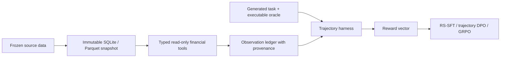

# FinTool-RL

> A replayable financial tool environment and decomposable reward system for multi-turn agent post-training.

FinTool-RL is the M1 foundation for studying rejection-sampling SFT, trajectory preference optimization,
and agentic GRPO on financial tool-use tasks.  The current repository is an **environment scaffold**, not a
trained financial model and not an investment product.

## Current status

Implemented and verified:

- 12 strictly typed, read-only financial tools;
- immutable SQLite snapshot metadata and SHA-256 manifest;
- explicit `as_of_time` guards against future-data access;
- deterministic observation IDs with source and parent-observation provenance;
- executable task oracles with numeric answers, units, and tolerances;
- company-disjoint fixture splits with a fact-leakage audit;
- decomposable reward vector plus a provisional hard-gated scalar reward;
- leakage-resistant trajectory harness, replay policy, and append-only store;
- OpenAI-compatible policy adapter for local vLLM or hosted baselines;
- action-parse and model-call errors recorded per trajectory without aborting a batch;
- 63 passing tests and an 85-task fixture oracle smoke run;
- a frozen 15-company SEC snapshot with 1,015 annual facts;
- an 800-task real-data set with exact 500/100/200 company-disjoint splits and a perfect oracle smoke run.

The bundled dataset is explicitly marked `synthetic_fixture`.  Its only purpose is CI and environment
development.  No fixture number should be presented as a real financial fact or experimental baseline.

## Architecture



The environment queries a local database for arbitrary valid parameters.  It does not merely look up canned
API responses.  Calculator tools consume observation IDs rather than ungrounded numbers, so calculation
provenance remains replayable.

## Reward contract

`RewardVector` reports eight separately recorded dimensions:

- `execution_valid`;
- `answer_correct`;
- `argument_valid`;
- `temporal_valid`;
- `grounded`;
- `format_valid`;
- `efficiency`;
- `required_family_coverage`.

Invalid arguments, temporal violations, execution failures, invalid final-answer formats, and
model-call failures are hard failures.  Format failures raised before any tool call are classified
from `terminal_reason` rather than collapsed into `execution_failure`.  The scalar weights in
`reward.py` are provisional; the vector is the source of truth until model baseline distributions
and reward-hacking cases have been audited.

Golden tool paths are not treated as the only valid solution.  Required tool *families* provide diagnostic
coverage while final numeric correctness and observation grounding remain the primary task signals.

The dimensions are recorded separately but are **not semantically orthogonal**; some are coupled by the
grading logic, and `total` is not a safe stand-in for the vector.  An adversarial audit of
`grade_trajectory()` (`docs/REWARD_ADVERSARIAL_REPORT.md`, `tests/test_reward_adversarial.py`) measured
three limits that any consumer of these numbers needs to know:

- `grounded` compares the reported value against the *cited observation's* scalar, never against the gold
  answer, so it is a function of how the answer was produced rather than of whether it is right: an answer
  copied from the wrong observation is graded as grounded;
- consequently a wrong answer can reach `total = 0.55` while a correct one can fall to `0.65`.  **Among
  trajectories without a hard failure**, a `total >= threshold` filter with `threshold` in `(0.55, 0.65]`
  is determined by `answer_correct` alone and the remaining dimensions have no effect on the selection.
  The restriction matters: `if hard_failure: total = 0.0` overrides every dimension, so a correct answer
  with a hard failure — a zero-tool-call guess, for instance — scores 0.0 and is excluded regardless;
- `grounded` does not read the `provenance.parents` DAG, and `calculate_ratio` accepts an unconstrained
  `scale`, so a trajectory that never queries the subject company can still score `1.0`.

Reward semantics are deliberately frozen until model baseline distributions exist; the audit records
current behaviour and proposes no code change.  Every claim in the audit carries a `[measured]` /
`[derived]` / `[inferred]` evidence tag.

## Quick start

The package itself uses only the Python standard library.  Tests require `pytest`.

```powershell
python -m venv .venv
.\.venv\Scripts\pip install -e ".[dev]"

fintool-rl bootstrap --overwrite
fintool-rl smoke
python -m pytest -q
```

Bootstrap creates ignored runtime artifacts:

- `data/fixture_snapshot.sqlite`;
- `data/generated_fixture_tasks.jsonl`;
- `data/fixture_snapshot.manifest.json`;
- `logs/oracle_smoke.sqlite` after the smoke run.

## Freezing the evaluation set

P1 measures a baseline and P5 re-measures after training.  The comparison is only meaningful if both
runs cover the same task set, so that set's identity is pinned to a committed manifest and **verified,
not merely recorded**:

```bash
fintool-rl freeze-evalset --tasks data/generated_sec_15_tasks.jsonl --db data/sec_snapshot_15.sqlite --evalset-id sec-800-v1
```

This writes `data/evalset_manifest.json`, which **must be committed** — it is the frozen identity, and a
manifest that exists only on one machine protects nothing.  `data/evalset_manifest_fixture.json` is the
committed manifest for the 85-task fixture set and is what the test suite exercises.

Identity is the **set of task ids per split**, not the bytes of the task file.  A whole-file hash trips on
key order, whitespace, and unrelated metadata edits; the task id set is what "this evaluation covered these
questions" actually means.  Both digests are recorded; the split digests are what verification compares.

Once the manifest exists at the default path, `fintool-rl baseline` and `fintool-rl analyze-baseline`
verify against it before writing any report and **raise** on divergence, naming the split and both digests.
The verified `evalset_id` and digests are then written into the report's `protocol` block — after the check,
so the block is evidence rather than a restatement of what the run chose to do.  `--allow-evalset-mismatch`
exists for knowing human override; it records `verified: false` and never masquerades as a passed check.

## Run a model baseline

Start an OpenAI-compatible endpoint such as vLLM, then configure:

```powershell
$env:FINTOOL_LLM_BASE_URL='http://127.0.0.1:8000/v1'
$env:FINTOOL_LLM_MODEL='Qwen3-1.7B'
$env:FINTOOL_LLM_API_KEY=''

.\scripts\run_baseline.ps1 -ModelName 'Qwen3-1.7B' -BaseUrl $env:FINTOOL_LLM_BASE_URL -Split test
```

The evaluated policy receives only `task_id`, question, cutoff, public tool contracts, prior observations,
and remaining steps.  It never receives oracle steps, answer tolerance, underlying fact keys, or split
metadata.

See [baseline runbook](docs/BASELINE_RUNBOOK.md) and [failure taxonomy](docs/FAILURE_TAXONOMY.md).
Re-analyze an existing store with `fintool-rl analyze-baseline`.

## Task generation

The fixture generator creates task text and executable oracle programs over the frozen database.  Every task
contains:

- numeric answer and tolerance;
- unit;
- `as_of_time`;
- difficulty and template family;
- required tool families for diagnostics;
- underlying fact keys used only for leakage audits;
- executable oracle steps used only by privileged environment verification.

The real-data generator builds executable questions directly from SEC XBRL facts.  It can create a larger
candidate pool from the historical window and deterministically balance template families into exact split
targets. Generated tasks and manually reviewed challenge tasks are reported separately rather than presented
as one homogeneous human-authored benchmark. FinanceBench/OpenFinData adaptation remains a later, separately
licensed challenge-set step.

See [M1 design contract](docs/M1_DESIGN.md) for acceptance gates and non-goals.

## SEC Company Facts import

The importer follows the SEC's documented Company Facts endpoint and selects annual USD facts filed no later
than the requested cutoff.  Downloading is deliberately separate from snapshot construction.

```powershell
fintool-rl sec-resolve-universe `
  --universe data\sec_universe.example.json `
  --output data\sec_company_map.json `
  --user-agent "FinTool-RL your-email@example.com"

fintool-rl sec-download `
  --mapping data\sec_company_map.json `
  --output-dir data\sec_raw `
  --user-agent "FinTool-RL your-email@example.com"

fintool-rl sec-import `
  --mapping data\sec_company_map.json `
  --input-dir data\sec_raw `
  --db data\sec_snapshot.sqlite `
  --manifest data\sec_snapshot.manifest.json `
  --as-of-time 2025-03-31 `
  --overwrite

fintool-rl generate-tasks `
  --db data\sec_snapshot.sqlite `
  --mapping data\sec_company_map.json `
  --output data\generated_sec_tasks.jsonl `
  --recent-years 18 `
  --train-target 500 `
  --dev-target 100 `
  --test-target 200
```

SEC states that `data.sec.gov` exposes JSON submissions and XBRL APIs without an API key, while automated
access must follow its fair-access policy and identify the requester. See the
[official EDGAR API documentation](https://www.sec.gov/search-filings/edgar-application-programming-interfaces).

The first real-data smoke run is recorded in [SEC real-data smoke](docs/SEC_REAL_DATA_SMOKE.md).

## Project boundaries

- No PDF parsing in M1.
- No live APIs during training or evaluation.
- No frontend before the training/evaluation loop is stable.
- No trading-return claim.
- No claim that RS-SFT, DPO, or GRPO improves performance before a frozen evaluation run exists.
- FinToolBench is a benchmark and design reference; this repository does not claim to reproduce all 760 tools.

## Planned milestones

1. **M1:** real frozen dataset, 12–20 tools, generated + audited tasks, local-model baselines, failure taxonomy.
2. **M2:** reward-filtered trajectory collection and rejection-sampling SFT.
3. **M3:** whole-trajectory DPO, followed by first-divergence analysis.
4. **M4:** multi-turn GRPO through verl-tool after environment and reward gates pass.
